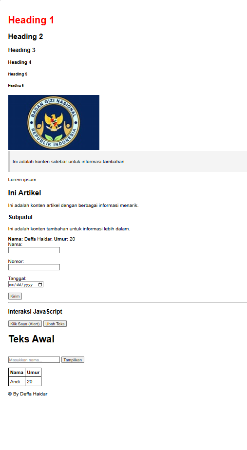

Fitur Utama
Halaman web ini mencakup komponen-komponen berikut:

1. Tipografi dan Hierarki Teks
Headings: Implementasi tag <h1> hingga <h6> untuk menunjukkan struktur konten.

Artikel: Penggunaan teks paragraf untuk konten utama dan subjudul.

2. Multimedia
Gambar: Penyisipan logo instansi (Badan Gizi Nasional Republik Indonesia) sebagai elemen visual pendukung.

3. Formulir Input (Form)
Halaman ini menyediakan berbagai tipe input data dasar, meliputi:

Teks & Nomor: Input nama dan nomor identitas.

Pemilih Tanggal & Waktu: Menggunakan atribut type="date" dan type="time".

Pemilih Warna: Input khusus untuk memilih warna secara visual.

Tombol Aksi: Tombol "Kirim" untuk pengiriman data dan tombol interaksi tambahan "Klik Saya".

Struktur File
praktikum.html: File utama yang berisi kode sumber HTML.

(Opsional) style.css: Jika terdapat pengaturan warna (seperti teks merah pada Heading 1).

# web dasar

